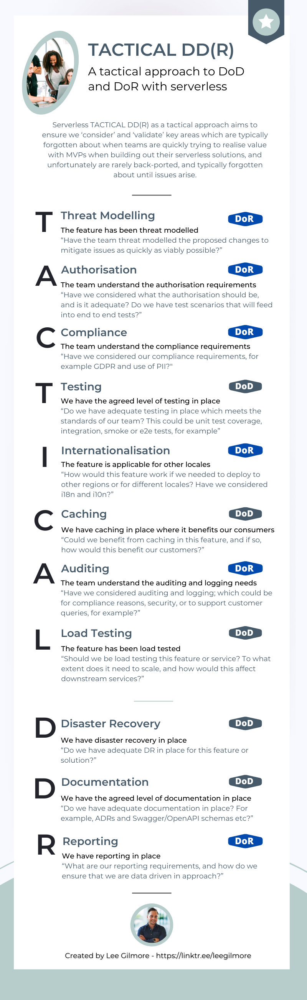

# A tactical approach to serverless DoR & DoD

When it comes to building out serverless architectures, one of the main benefits of getting started is how easy it is, and one of the biggest downsides is also how easy it is!

Teams can very quickly build out scalable MVPs (_Minimum Viable Products_) using AWS services like API Gateway, Lambda and DynamoDB, but the downside of this is that many teams forget how to correctly productionise these solutions, and miss really key factors that end up biting them at a later date!

# Template

[This article](https://leejamesgilmore.medium.com/serverless-tactical-dd-r-23d18d529fa1) discusses how to use an approach I call **Serverless TACTICAL DD(R)** which compliments a teams DoR (_Definition of Ready_) and DoD (_Definition of Done_), and if they don't currently use them, acts as a base to start working from in the serverless World.

Please feel free to link to or download this infographic as a template for serverless teams to adopt:

** The information provided are my own personal views and I accept no responsibility on the use of the information. **
